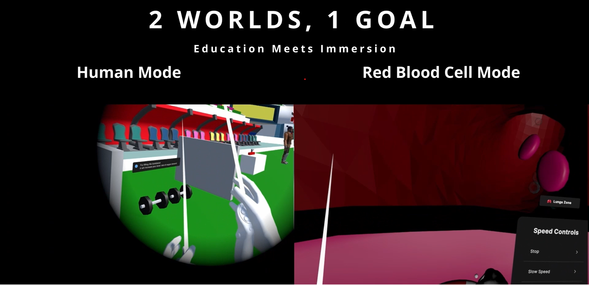

# LifelineVR

[🕹️ APK](_submissions/LifeLineVR.apk) | [Report](_submissions/SC4060%20Final%20Project%20Report%20-%20Group%206.pdf) | [Slides](_submissions/Presentation%20Slides%20-%20Group%206.pptx) | [🎥 Game Trailer Video](https://youtu.be/-jsXb65ain0)

LifeLine VR is an immersive educational VR experience designed to highlight the importance of red blood cells and constant blood donation through interactive, gamified storytelling.

Built using Unity and designed for Meta Quest 3, this project was developed by Group 6 for Nanyang Technological University's SC4060 Virtual and Augmented Reality Module (AY24/25 S2).

## 🧠 Project Motivation

- **Red Blood Cells:** Vital for oxygen transport and energy production. Yet, their microscopic processes are hard to visualize.
- **Blood Donation Awareness:** Many are unaware of the urgent, ongoing need for blood due to storage limitations and shortages.

LifeLine VR aims to:

- Deepen understanding of red blood cells' role.
- Raise awareness and empathy toward blood donation.

## 🎮 Gameplay Overview

### 🌍 Dual Game Modes

- **Human Mode:** Navigate a football stadium, perform physical activities, and request blood donations.
- **Red Blood Cell Mode:** Shrink to a cellular level and navigate the bloodstream in a ship to transport oxygen.

### 🕹️ Game Mechanics

- **Oxygen & Red Blood Cell Levels:** Track and manage them to stay alive.
- **Activity Simulation:** Walking, running, and lifting dumbbells dynamically impact oxygen demand.
- **Time Scaling:** Each game minute equals 10 real-world days. Red blood cells decrease gradually over time.
- **Blood Donation System:** NPCs offer blood packs based on randomized probability.
- **Collect/Deposit Oxygen:** Players collect oxygen in the lungs and deliver it to body parts.

### 💀 Game Over Conditions

- Any vital organ’s oxygen level or red blood cell level reaches zero.

## 🔧 Key Features

- Immersive 3D environments (football stadium & bloodstream).
- Visual alerts and feedback for vital level changes.
- Red Blood Cell ship with pitch/yaw controls, speed panel, and auto-steering.
- Fridge inventory system for perishable blood packs.
- Adjustable game difficulty and mode switching.

## 🛠️ Tech Stack

- **Engine:** Unity 2021.3.18f1
- **Language:** C#
- **VR Toolkit:** XR Interaction Toolkit
- **Version Control:** Git & GitHub
- **UI Design:** Figma
- **3D Modeling:** Blender
- **VR Hardware:** Meta Quest 3

## 📦 Assets & Libraries

- **Custom Models:** Blood cells, blood vessel paths, oxygen balls, blood packs.
- **Libraries:** FloatGrids for UI
- **External Assets:**
  - [Stadium](https://assetstore.unity.com/packages/3d/environments/urban/grand-stadium-v2-0-254584)
  - [NPCs](https://assetstore.unity.com/packages/3d/characters/humanoids/fantasy/free-low-poly-human-rpg-character-219979)
  - [Steering Wheel](https://sketchfab.com/3d-models/steering-wheel-2-e81c3a62808b46998b2e35124028a614)
  - [Icons8](https://icons8.com/)

## 🌟 Future Improvements

- More diverse activities (sports, mini-games).
- Multiplayer mode for collaborative oxygen delivery.
- Enhanced NPC interaction with dialogues and emotional feedback.
- Dynamic narrative extension (e.g., treatment and recovery).
- Ambient music and immersive sound effects.

## Contributors

> “LifeLine VR isn't just a game—it's a journey into the lifeblood of survival.”
